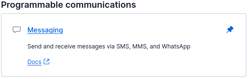
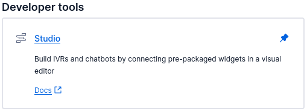
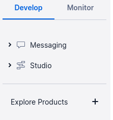
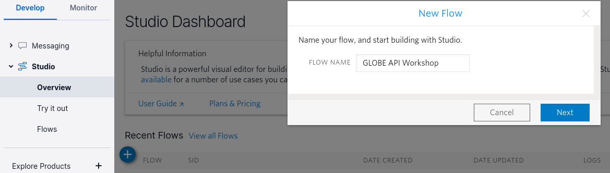
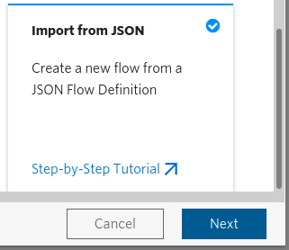
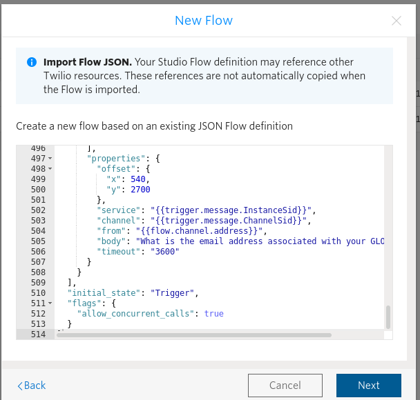

# GLOBE API Workshop
A workshop showing how API's are used to allow programs to communicate amoungst each other to do useful tasks, in this case, send a message that relays the information gathered to an API which in turn sends the information to another API so it can send an email to another system, you'll recieve a reply message sent from another API that links to yet another system to show you the data you sent in. The hope is that this project will open your eyes to the possibilites of connecting diverse programs together using their various API's and how one might go about creating their own API to facilitate these interactions.

## Twilio
We'll be using Twilio Studio to define the messages, and responses we'll be sending out to users over text message (SMS). Twilio Studio offers a free WhatsApp solution for sending messages, and a paid SMS solution that you can setup to use a real phone number and send text messages to it from your cell phone.

1. Visit [Twilio](https://www.twilio.com/referral/UXbeHb) and create an account, then login
2. Click on [Explore Products](https://console.twilio.com/develop/explore) and click on the Pin icon next to Messaging and Studio


3. Twilio should now list the two pinned products, Messaging and Studio, on the sidebar

4. In the `Project Info` section on your `Dashboard` you'll find your `Twilio Account SID and AUTH Token`. You'll need to save both of those in your Ansible Vault secrets file that we'll talk about further down this README.
5. Click on Messaging, > Then click on Try it out, > Then click on Send a WhatsApp message
  - Follow the on-screen instructions to set up your testing sandbox
6. Click on Studio, > Then click on Overview, > Then click on the blue circle with the + icon to Create a New Flow
  - Give your flow a meaningful name, we'll call this one GLOBE API Workshop
  - Use the default template called Start from sratch, > Then click on Next
7. Follow along [with this recording](https://mega.nz/file/mKQTlS6D#DycyFtYcd4kRVz6UEVzEZXfV6JNNhpTbCB9ZTyi0cHY) to create the flow we'll be using for our project in Twilio Studio:
8. TODO: Working on a final tutorial video for this project! Stay tuned!

### Optional Step for Twilio Studio: 
Rather than follow along with the recording above, you may try using the import JSON Flow Definition feature of Twilio Studio which is Beta at the moment and has some warning messages you'll need to adhere to in order for an imported flow to work as expected.

Here's a link to the warning on the docs page worth considering: https://www.twilio.com/docs/studio/user-guide#importing-flow-data

  - Give your flow a meaningful name, we'll call this one GLOBE API Workshop
  - Don't use the default template called Start from sratch, > rather, scroll down to the template called Import from JSON and click on it, > Then click on Next
  - 
  - Copy the contents of [This JSON file](docs/json_flow_definition.json)
  - Paste the contents of the JSON Flow Definition you just copied into the dialog window, > Then click on Next
  - 
  - Update the 3rd to last, and 2nd to last `Make HTTP Request` widgets to that the URL contains your domain, then `Save` each widget and `Publish`

## SendGrid
We'll be using SendGrid to email the measurement data to the GLOBE Email Data Entry system.

1. Visit [SendGrid](https://sendgrid.com) and create an account, then login
2. Follow the instructions about setting up your sender identity
3. Go to Settings > [API Keys](https://app.sendgrid.com/settings/api_keys)
4. Create an API Key
5. Make note of the API Key as you'll need to save it in your Ansible Vault secrets file. Also make note of your verified email you used to setup your sender identity, you'll need to save that value in your `ansible/group_vars/all/config` file


### FreeBSD
#### FreeBSD Development Environment
The following commands expect that you're running FreeBSD as your Operating System. No worries, as the name implies, the Operating System is free and there are instructions I've written up for you to get started with this wonderful Open Source Operating System, FreeBSD. For information on how to setup your own FreeBSD system as a virtual machine running on your existing computer in a program called VirtualBox, see the step-by-step [BSD.pw Workshop, Getting Started with FreeBSD](https://github.com/possnfiffer/bsd-pw/blob/gh-pages/docs/Intro_to_FreeBSD_Workshop.md) No need to follow the entire guide as there are extras in there. Feel free to stop when you get to the Jails section.

We'll use Ansible to automate the install and configuration of our database, appserver, webserver, and operating system. We will use `git` to clone the project repository. Open up the terminal you installed in the BSD Workshop guide called `sakura` then type the following and enter your password when prompted:
```
sudo pkg install -y py38-ansible git-lite
```

## UPDATE: Digital Ocean Droplet Support for FreeBSD has degraded
#### You can still use FreeBSD on Digital Ocean, you just have to upload an image manually now and configure it yourself. I'll make a guide for this and put it on my YouTube channel, keep an eye on [BSD.pw](http://BSD.pw) for updates.

Create an SSH keypair to use with Digital Ocean, the online cloud provider we'll use to create a remote FreeBSD machine that will host our PostgreSQL database, Python appserver, Nginx webserver, and DNS nameservers.

Again in your `sakura` terminal type the following and answer the prompts, set a passphrase on your key for safe keeping
```
ssh-keygen
```

Add your SSH key to ssh-agent and enter in the passphrase set above when prompted:
```
ssh-agent tcsh
ssh-add .ssh/id_rsa
```

Create a Projects directory and clone this GitHub repository into that directory

Change into the project directory
```
mkdir Projects
cd Projects
git clone git@github.com:possnfiffer/globe_api_workshop.git
cd ~/Projects/globe_api_workshop
```

Edit the `ansible/group_vars/all/config` file. Be sure to include values for each of the variables in this file.
```
vim ansible/group_vars/all/config
```

Using vim to edit text files was covered in the BSD Programming Workshop guide referenced above feel free to revisit the guide for pointers.

Next, create a secrets file to store your database password and other secrets, again be sure to include values for each of the variables listed below:
```
ansible-vault create ansible/group_vars/all/secrets
```

put the following line into the secrets file
```
db_password: YOUR_PASSWORD_FOR_POSTGRESQL_HERE
sendgrid_secret_key: YOUR_SENDGRID_SECRET_KEY_HERE
twilio_account_sid: YOUR_TWILIO_ACCOUNT_SID_HERE
twilio_auth_token: YOUR_TWILIO_AUTH_TOKEN_HERE
```

after creation, you can `view` and `edit` your Ansible Vault secrets file with the following commands
```
ansible-vault view ansible/group_vars/all/secrets
ansible-vault edit ansible/group_vars/all/secrets
```

Visit [Digital Ocean](https://m.do.co/c/42ca15dcb41e) and create an account, be sure to use this link https://m.do.co/c/42ca15dcb41e and you'll get a $100 account credit upon signup.

Visit your domain registrar and change the nameservers for your domain to the following:
```
ns1.digitalocean.com
ns2.digitalocean.com
ns3.digitalocean.com
```

_Keep in mind the steps for setting nameservers vary depending on the registrar you used to purchase your particular domain, take a look at their documentation for setting your own nameservers_

Now go back to Digital Ocean
1. Click on the name of your Project in the sidebar under the `Projects` section and Create a Droplet within your project
2. For the droplet type be sure to click on `FreeBSD` and use the latest version with `ZFS`
3. Choose the least expensive droplet, doesn't mean it isn't plenty of resources for a web app, in fact I've seen over 30,000 users a day access a website hosted on one of my FreeBSD droplets on Digital Ocean running a Python web app with Nginx and a database and it didn't even sweat or throw an error, pretty amazing if you ask me considering I've only ever used the lease expensive droplet for my web apps.
4. Click on New SSH Key and paste in the contents of your `.ssh/id_rsa.pub` key then give it a name and click on Add SSH Key
5. Click Create Droplet
6. Click on the name of your Project in the sidebar under the `Projects` section
7. Click on Manage DNS on DigitalOcean
8. Enter in your domain name and click Add Domain
9. Click on your domain name once it's been added
10. Enter in the FQDN for the hostname you want for your project e.g. globe-api-workshop.lab (no need to include the .bsd.pw part of the domain, you'll see that it gets added to the end automatically)
11. In next field called `Will Redirect To` select your FreeBSD Droplet from the dropdown menu and finsh with the Create Record button. If you don't see your droplet automatically appear in this menu, check that you created the droplet within your Project or try creating the Droplet again from the Project page using the Create a Droplet link
12. You should now see the A record in your DNS settings sending the hostname you entered to the droplet you created, use the copy button next to the droplet IP address that appears when you mouse over the droplet information to copy the droplet IP.
13. Edit your `ansible/hosts` file and include the droplet IP address under each section. Feel free to use the FQDN of your host rather than the IP, so globe-api-workshop.lab.bsd.pw would work in place of an IP address

```
vim ansible/hosts
```

```
[common]
DROPLET_IP_HERE

[database]
DROPLET_IP_HERE

[appserver]
DROPLET_IP_HERE

[webserver]
DROPLET_IP_HERE
```

If your GitHub repo is Private you'll need to setup a [deploy key](https://docs.github.com/en/developers/overview/managing-deploy-keys) create an SSH keypair with no passphrase to use for your projects deploy keys and save them in your Downloads folder e.g. /home/roller/Downloads/read_only_key 
```
cd ~/Downloads
ssh-keygen -t ed25519 -C "roller@bsd.pw" -f read_only_key
```

run the playbook to setup the database, appserver and webserver
```
cd ~/Projects/globe-api-workshop/ansible
ansible-playbook --ask-vault-pass deploy-app-db-web-freebsd.yml
```

_Answer the VAULT prompt with your Ansible Vault secret file password_

Now you can use WhatsApp (discussed in the video linked in the Twilio section of this README) to send your messages about the current temperature at your GLOBE Data Entry Site to the system and you'll get a reply that with a link to where you can see your measurement data, Enjoy!

### PostgreSQL: Information about the database used in this project for those interested in learning more

#### Security

#### Access Controls
##### Features:
1. Users - Roles (Roles are users or groups)
2. Config Files:
  - `pg_hba.conf` 
  - `postgresql.conf`
3. Central accounts DB which spans all of the various databases in the cluster - accounts MUST be unique
4. Default setup includes 1 user - `postgres` - Super User
5. Privileges are managed with:

SQL statements to be run within `psql`
  - `GRANT`
  - `REVOKE`
  - `ALTER` to change DB object ownership
  - `CREATE` followed by `ROLE` or `USER`
  - `DROP` followed by `ROLE` or `USER`

or commands to be run from a shell
  - `createuser`
  - `dropuser`
6. Special role named: `PUBLIC` grants assigned privilege to ALL system users
  - `PUBLIC` is a special group, to which ALL users are members

##### Tasks:
1. Create a User
```
psql -U postgres -c "CREATE ROLE SET_POSTGRES_USERNAME_HERE PASSWORD 'SET_POSTGRES_PASSWORD_HERE' CREATEDB INHERIT LOGIN;"
```
2. Ensure users must provide password when logging in
  - Edit `pg_hba.conf` in your postgresql data directory
  - Make sure the last column of the uncommented lines at the bottom of the file called `METHOD` is not set to `trust`, set it to `md5` instead if it's not already that value
  - Restart postgresql

##### psql
Use `psql` to connect to the db

NOTE: Attempts by default to connect the user to a db named the username. To override this, you must specifify a database.

For instance, if you had a user named `postgresql_username` you could connect to the default `postgres` database with `psql -U postgresql_username postgres`

Either set `PGUSER=postgres` as an environment variable or use `psql -U postgres` to connect as the `postgres` user

`\l` to show the list of databases

`\du` to show the list of roles

`\dt` to show the list of tables

`\q` to quit

`\!` to escape to shell

#### SSL
##### Features:
1. True end-to-end encryption protection
2. Listens to same, clear-text port: TCP:5432
3. Auto-negotiates with client conneciton type unless server config `pg_hba.conf` enforces type
4. Support server (default) & client certificates

##### Requires:
1. Server keypair: `server.crt` (public) & `server.key` (private) stored in postgresql data directory
2. `server.key` must be chmod 600
3. `ssl=on` - enabled via: `postgresql.conf`

##### Tasks:
1. Generate Server Keypair
  - `openssl req -newkey rsa:2048 -new -x509 -days 3650 -nodes -out server.crt -keyout server.key`
  - `chown postgres server.key && chmod 0600 server.key`
  - place `server.crt` and `server.key` in postgresql data directory
2. Configure postgresql
  - add `ssl=on` to `postgresql.conf`
  - restart postgresql
3. Force SSL in `pg_hba.conf`
  - comment out the lines at the bottom of the file that start with `local`
  - Make sure the first column of the uncommented lines at the bottom of the file called `TYPE` is not set to `host`, set it to `hostssl` instead
  - Restart postgresql
